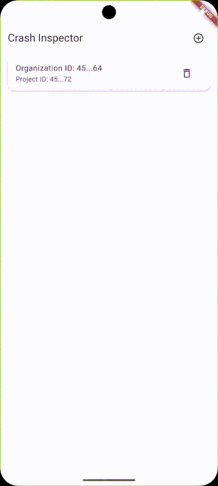

# Crash Inspector

<h1 align="center">
  <br>
  <a href="https://flutter.dev/"></a>
  <br>
  Crash Inspector
  <br>
</h1>

<h4 align="center">A Flutter application for crash inspection and analysis.</h4>

<p align="center">
  <a href="https://flutter.dev/">
    
  </a>
  <a href="https://dart.dev/">
    
  </a>
  <a href="https://pub.dev/packages/bloc">
    
  </a>
  <a href="https://pub.dev/packages/flutter_modular">
    
  </a>
  <a href="https://pub.dev/packages/dio">
    
  </a>
  <a href="https://pub.dev/packages/freezed">
    
  </a>
  <a href="https://pub.dev/packages/lottie">
    
  </a>
</p>

<p align="center">
  <a href="#overview">Overview</a> •
  <a href="#features">Features</a> •
  <a href="#prerequisites">Prerequisites</a> •
  <a href="#installation">Installation</a> •
  <a href="#project-structure">Project Structure</a> •
  <a href="#dependencies">Dependencies</a> •
  <a href="#contributing">Contributing</a> •
  <a href="#authors">Authors</a> •
  <a href="#roadmap">Roadmap</a>
</p>



## Overview

Crash Inspector is a Flutter application designed to help users inspect and analyze crash reports. The application uses modern Flutter architecture patterns and best practices to provide a robust and maintainable codebase.

## Features

- Modern architecture using BLoC pattern
- Modular routing system
- Localization support
- Caching system
- Smart retry mechanism for network requests
- Material Design implementation
- Lottie animations support

## Prerequisites

### This project requires:
- [Flutter SDK] version 3.7.2 or higher
- [Dart SDK] version 3.7.2 or higher
- [Android Studio] or [VS Code] with Flutter extensions
- [Git] for version control

## Installation

Para clonar está aplicación desde la linea de comando:

```bash
git clone https://github.com/yourusername/crash_inspector.git
cd crash_inspector
flutter pub get
flutter run
```

## Project Structure

```
lib/
├── core/           # Core functionality and utilities
├── data/          # Data layer (repositories, data sources)
├── domain/        # Business logic and entities
├── presentation/  # UI layer (screens, widgets)
└── main.dart      # Application entry point
```

## Dependencies

### Main Dependencies
- `flutter_modular`: ^6.3.4 - For modular architecture
- `bloc`: ^8.1.4 - For state management
- `dio`: ^5.4.0 - For HTTP requests
- `dartz`: ^0.10.1 - For functional programming
- `freezed`: ^2.5.2 - For immutable models
- `lottie`: ^3.3.1 - For animations
- `shared_preferences`: ^2.5.3 - For local storage

### Dev Dependencies
- `build_runner`: ^2.4.11 - For code generation
- `mockito`: ^5.4.4 - For testing
- `flutter_lints`: ^4.0.0 - For code quality

## Contributing

1. Fork the repository
2. Create your feature branch (`git checkout -b feature/amazing-feature`)
3. Commit your changes (`git commit -m 'Add some amazing feature'`)
4. Push to the branch (`git push origin feature/amazing-feature`)
5. Open a Pull Request

## Authors

| [<br><sub>Your Name</sub>](https://github.com/wilver06w) |
|:-------------------------------------------------------------------------------------------------------------------:|

## Roadmap

- [ ] Add crash report export functionality
- [ ] Implement crash report search
