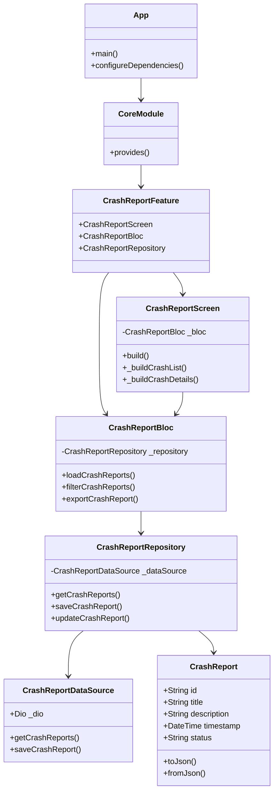

# Crash inspector

<h1 align="center">
  <br>
  <a href="https://flutter.dev/"></a>
  <br>
  Crash inspector
  <br>
</h1>

<h4 align="center">Una aplicación Flutter para la inspección y análisis de errores.</h4>

<p align="center">
  <a href="https://flutter.dev/">
    
  </a>
  <a href="https://dart.dev/">
    
  </a>
  <a href="https://pub.dev/packages/bloc">
    
  </a>
  <a href="https://pub.dev/packages/flutter_modular">
    
  </a>
  <a href="https://pub.dev/packages/dio">
    
  </a>
  <a href="https://pub.dev/packages/freezed">
    
  </a>
  <a href="https://pub.dev/packages/lottie">
    
  </a>
</p>


<p align="center">
  <a href="#resumen">Resumen</a> •
  <a href="#características">Características</a> •
  <a href="#requisitos-previos">Requisitos Previos</a> •
  <a href="#instalación">Instalación</a> •
  <a href="#estructura-del-proyecto">Estructura del Proyecto</a> •
  <a href="#dependencias">Dependencias</a> •
  <a href="#contribuciones">Contribuciones</a> •
  <a href="#autores">Autores</a> •
  <a href="#hoja-de-ruta">Hoja de Ruta</a>
</p>

<p align="center">
  
</p>

## Resumen

Inspector de Errores es una aplicación Flutter diseñada para ayudar a los usuarios a inspeccionar y analizar reportes de errores. Utiliza patrones modernos de arquitectura en Flutter y buenas prácticas para ofrecer una base de código robusta y mantenible.

## Características

- Arquitectura moderna utilizando el patrón BLoC
- Sistema de enrutamiento modular
- Soporte para localización (traducción de idiomas)
- Sistema de caché
- Mecanismo inteligente de reintentos para peticiones de red
- Implementación basada en Material Design
- Soporte para animaciones con Lottie

## Requisitos Previos

### Este proyecto requiere:
- [Flutter SDK] versión 3.7.2 o superior
- [Dart SDK] versión 3.7.2 o superior
- [Android Studio] o [VS Code] con extensiones de Flutter
- [Git] para control de versiones

## Instalación

Para clonar esta aplicación desde la línea de comandos:

```bash
git clone https://github.com/yourusername/crash_inspector.git
cd crash_inspector
flutter pub get
flutter run
```

## Estructura del Proyecto

```
lib/
├── core/           # Core functionality and utilities
├── data/          # Data layer (repositories, data sources)
├── domain/        # Business logic and entities
├── presentation/  # UI layer (screens, widgets)
└── main.dart      # Application entry point
```

## Diagrama de Clases



### Descripción del Diagrama

El diagrama muestra la arquitectura de la aplicación siguiendo los principios de Clean Architecture y el patrón BLoC:

1. **App**: Punto de entrada de la aplicación que configura las dependencias y módulos.

2. **CoreModule**: Módulo principal que proporciona las dependencias globales.

3. **Features**: Módulos de características específicas (en este caso, CrashReportFeature).

4. **BLoC**: Implementación del patrón BLoC para la gestión del estado:
   - CrashReportBloc: Maneja la lógica de negocio y el estado de los reportes de errores.

5. **Repository**: Capa de abstracción para el acceso a datos:
   - CrashReportRepository: Coordina las operaciones de datos.

6. **Data Sources**: Fuentes de datos (API, base de datos local):
   - CrashReportDataSource: Implementa las operaciones de red usando Dio.

7. **Models**: Entidades de dominio:
   - CrashReport: Modelo de datos para los reportes de errores.

8. **UI Components**: Componentes de la interfaz de usuario:
   - CrashReportScreen: Pantalla principal para mostrar los reportes.

## Dependencias

### Dependencias Principales
- `flutter_modular`: ^6.3.4 - Para arquitectura modular
- `bloc`: ^8.1.4 - Para gestión de estado
- `dio`: ^5.4.0 - Para peticiones HTTP
- `dartz`: ^0.10.1 - Para programación funcional
- `freezed`: ^2.5.2 - Para modelos inmutables
- `lottie`: ^3.3.1 - Para animaciones
- `shared_preferences`: ^2.5.3 - Para almacenamiento local

### Dependencias de Desarrollo
- `build_runner`: ^2.4.11 - Para generación de código
- `mockito`: ^5.4.4 - Para pruebas
- `flutter_lints`: ^4.0.0 - Para calidad de código

## Contribuciones

1. Hacer fork del repositorio
2. Crear una rama para tu característica (`git checkout -b feature/caracteristica-increible`)
3. Hacer commit de tus cambios (`git commit -m 'Agregar característica increíble'`)
4. Hacer push a la rama (`git push origin feature/caracteristica-increible`)
5. Abrir un Pull Request

## Autores

| [<br><sub>Wilver Rojas</sub>](https://github.com/wilver06w) |
|:-------------------------------------------------------------------------------------------------------------------:|

## Hoja de Ruta

- [ ] Agregar funcionalidad de exportación de reportes de errores
- [ ] Implementar búsqueda de reportes de errores